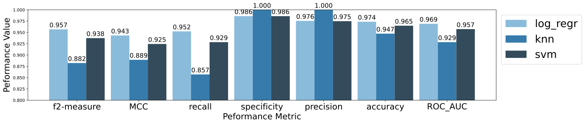
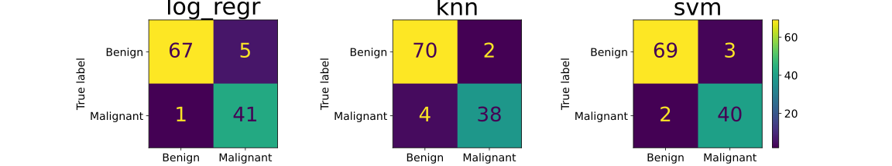

# Breast Cancer Classification with Machine Learning

## Project Overview

Every year \~55,900 people in the UK are diagnosed with breast cancer. Early, accurate detection saves lives and reduces pressure on clinical resources.
This project compares three machine learning algorithms: **Logistic Regression, K-Nearest Neighbours (KNN), and Support Vector Machine (SVM)** on the **Wisconsin Diagnostic Breast Cancer (WDBC)** dataset.

A more detailed description of our methadology and results can be found in `Group_9.pdf`.

## Dataset

* 569 samples (212 malignant, 357 benign)
* 32 real-valued features extracted from digitised images of FNA breast-tissue nuclei
* Source: UCI Machine Learning Repository

## Pipeline

1. **Exploratory Data Analysis** – statistical summaries, distribution plots, outlier detection.
2. **Pre-processing**

   * Dropped `id` column
   * Transformation Scalars and PCA (retain 95% variance)
   * Stratified 80 / 20 split, 7-fold cross-validation (×3 repeats)
3. **Model Training**

   * **LogReg**: solvers {lbfgs, liblinear…}, C ∈ 10⁻³…10³, penalties {L1, L2}
   * **KNN**: k ∈ {1, 3, 5, 9, 15, 23}, metrics {euclidean, manhattan, minkowski}
   * **SVM**: kernels {linear, poly, rbf, sigmoid}, C ∈ 10⁻³…10³, γ {scale, auto}
4. **Evaluation Metrics** – Matthews Correlation Coefficient (MCC) primary, plus Recall, F₂, Specificity, ROC-AUC.

## Results

Logistic Regression showed slightly better overall metrics than SVM, especially in recall, which is particularly important for medical diagnosis.

## Interpreting the Metrics

* **Recall** indicates how many actual malignancies were correctly identified.
* **Specificity** shows how many benign cases were correctly identified.
* **MCC** provides a balanced metric that accounts for all four elements of the confusion matrix.

## Key Findings

* Logistic Regression, when combined with appropriate preprocessing, performed best overall.
* PCA effectively reduced noise and computation while maintaining accuracy.
* KNN demonstrated high specificity but lower recall, which is less desirable in this context.

## Future Work

* Validate findings on larger and more diverse datasets.
* Explore a greater number of hyperparameter combinations.
* Investigate deployment in clinical environments.

## Acknowledgements

* Dataset provided by the UCI Machine Learning Repository.
